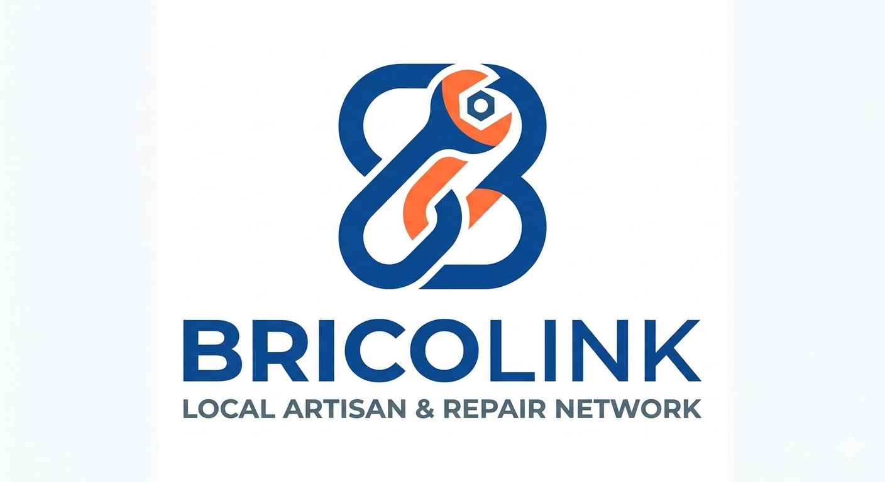

  

  <h1>BricoLink: Artisan Service Platform</h1>
  
Connecting communities with trusted local artisans for reliable craftsmanship and home services.

## 🏢 Organization Repositories

This organization contains the core components of the BricoLink platform:

### 1. 🖥️ [bricolink-laravel](https://github.com/bricolink-project-tmp/bricolink-laravel)
The central hub for business logic, authentication, and the artisan marketplace.
* **Tech Stack**: Laravel 11, Blade, Tailwind CSS, **PostgreSQL**.
* **Deployment**: Fully containerized with **Docker** for Render.
* **Key Features**: **Deal Room Architecture**, **Real-Time Negotiation Chat**, and a rich booking pipeline with dual-approval logic.

### 2. 🗄️ Database Foundation (PostgreSQL)
**Notice: We have officially transitioned to PostgreSQL for high-performance cloud deployment.**
* **Tech Stack**: PostgreSQL.
* **Purpose**: We have migrated from SQLite/MySQL to PostgreSQL to support robust concurrent connections and seamless integration with Render. The schema is fully managed via Laravel Migrations and includes automatic Artisan profile initialization.

### 3. 📚 [bricolink-docs](https://github.com/bricolink-project-tmp/bricolink-docs)
Centralized project guidelines, system architecture, and setup instructions.
* **Purpose**: Contains updated documentation on the PostgreSQL migration, Docker build process, Deal Room workflow, and our collaborative Git protocols.

---

### 🚀 Upcoming Phases
- **📱 Mobile Application**: A cross-platform mobile app designed to consume the Laravel API for a seamless on-the-go booking experience.

 

  <i>A professional initiative developed by the BricoLink Project Team.</i>

